# RestoQuick — Platform Documentation

**Single source of truth** for building native mobile clients, integrations, and understanding how RestoQuick works end-to-end.

| | |
| --- | --- |
| **Production base URL** | `https://restoquicknuxt-production.up.railway.app` |
| **Content type** | `application/json` unless noted |
| **Auth** | Clerk session on all `/api/*` routes (see [Authentication](#authentication)) |
| **Money** | Always integer **cents** |
| **Realtime** | WebSocket at `wss://<host>/api/websocket` (kitchen orders only) |

---

## Table of contents

### Part 1 — Architecture & data flows

- [What RestoQuick is](#what-restoquick-is)
- [System architecture](#system-architecture)
- [Client surfaces](#client-surfaces)
- [Authentication flow](#authentication-flow)
- [Data model & relationships](#data-model--relationships)
- [Order lifecycle (state machine)](#order-lifecycle-state-machine)
- [Flow: POS dining order](#flow-pos-dining-order)
- [Flow: POS takeaway order](#flow-pos-takeaway-order)
- [Flow: Customer QR / Stripe self-order](#flow-customer-qr--stripe-self-order)
- [Flow: Kitchen display (REST + WebSocket)](#flow-kitchen-display-rest--websocket)
- [Flow: Cashier table checkout](#flow-cashier-table-checkout)
- [Flow: Cashier takeaway checkout](#flow-cashier-takeaway-checkout)
- [Flow: Bookings (manual + Vapi voice)](#flow-bookings-manual--vapi-voice)
- [Flow: Table sessions](#flow-table-sessions)
- [Flow: Staff, roster & leave](#flow-staff-roster--leave)
- [Flow: Menu management](#flow-menu-management)
- [Flow: Stock management](#flow-stock-management)
- [Flow: Dashboard analytics](#flow-dashboard-analytics)
- [Flow: AI agents](#flow-ai-agents)
- [Native app implementation guide](#native-app-implementation-guide)
- [Feature → API quick map](#feature--api-quick-map)

### Part 2 — API reference

- [Authentication](#authentication)
- [Conventions & data types](#conventions--data-types)
- [Enums](#enums)
- [Core models](#core-models)
- [WebSocket (real-time kitchen)](#websocket-real-time-kitchen)
- [Bookings](#bookings)
- [Dashboard stats](#dashboard-stats)
- [Leave requests](#leave-requests)
- [Menu](#menu)
- [Orders](#orders)
- [Order items](#order-items)
- [Order checkout](#order-checkout)
- [POS orders](#pos-orders)
- [Receipt printing](#receipt-printing)
- [Shifts](#shifts)
- [Staff](#staff)
- [Stock](#stock)
- [Stripe checkout](#stripe-checkout)
- [Table sessions](#table-sessions)
- [Tables](#tables)
- [Vapi booking tool](#vapi-booking-tool)
- [AI agents](#ai-agents-1)
- [Error codes](#error-codes)

---

# Part 1 — Architecture & data flows

## What RestoQuick is

RestoQuick is a **full-stack restaurant operations platform**. One Nuxt 4 backend (Nitro + PostgreSQL/Prisma) powers:

- **Staff dashboard** — POS, cashier, kitchen display, orders, menu, tables, bookings, roster, stock, analytics, AI assistants
- **Customer-facing QR ordering** — scan table QR → browse menu → Stripe checkout → order hits kitchen
- **Native mobile clients** — consume the same REST + WebSocket APIs documented in Part 2

Every feature follows the same pattern:

```
UI (web or native)  →  HTTP / WebSocket  →  server/api/*  →  Prisma  →  PostgreSQL
                                              ↓
                                    kitchenSocket.broadCast()  (orders only)
                                              ↓
                                    all connected kitchen clients
```

---

## System architecture

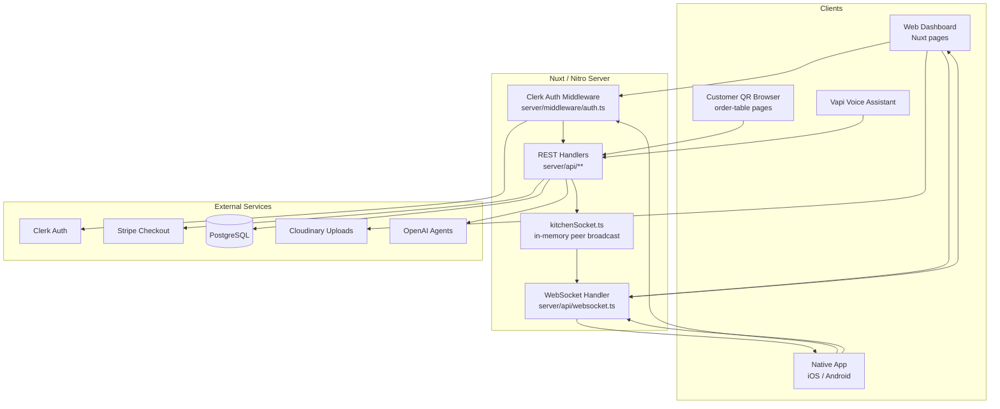

### Key server directories

| Path | Purpose |
| ---- | ------- |
| `server/api/` | One file per route — Nitro file-based routing |
| `server/middleware/auth.ts` | Clerk auth guard on `/api/*` |
| `server/utils/kitchenSocket.ts` | In-memory WebSocket peer registry + `broadCast()` |
| `server/utils/prisma.ts` | Shared Prisma client |
| `prisma/schema.prisma` | Authoritative database schema |
| `types/` | Shared TypeScript types (orders, websocket payload) |
| `app/pages/` | Web UI pages (dashboard, POS, kitchen, QR ordering) |
| `app/composables/` | Shared client logic (WebSocket, cart, modals) |

---

## Client surfaces

| Surface | Who uses it | Auth | Primary APIs |
| ------- | ----------- | ---- | ------------ |
| **Dashboard** (`/dashboard/*`) | Staff (Chef, Waiter, Manager…) | Clerk required | All `/api/*` routes |
| **Kitchen display** (`/dashboard/kitchen`) | Kitchen staff | Clerk + WebSocket | `GET /api/orders/pending`, `WS /api/websocket`, `PATCH /api/orders/{id}/status` |
| **POS** (`/dashboard/pos`) | Waiters | Clerk | `POST /api/orders/pos/*`, `GET /api/menu`, table sessions |
| **Cashier** (`/dashboard/cashier`) | Front desk | Clerk | Checkout routes, `mark-paid`, `closesales` |
| **Customer QR** (`/order-table/{table_id}`) | Diners | Public pages; Stripe for payment | `POST /api/stripe-checkout`, session-status |
| **Native app** | Staff mobile | Clerk mobile SDK | Same REST + WebSocket as dashboard |
| **Vapi voice** | Phone callers | M2M to booking tool | `GET/POST /api/vapi-booking-tool` |

---

## Authentication flow

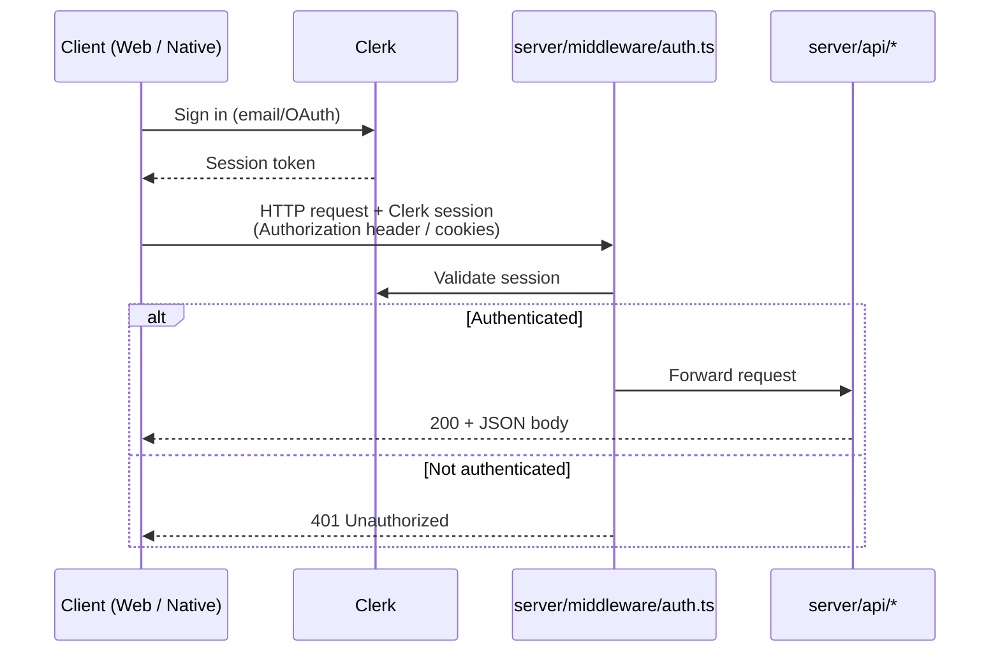

**Native app rules:**

1. Integrate Clerk mobile SDK (same app as web dashboard).
2. Attach session token to every `/api/*` request.
3. Attach same token to WebSocket upgrade (`wss://<host>/api/websocket`).
4. On 401, refresh session and retry.

Optional org restriction: if `NUXT_CLERK_ORG_ID` is set, only members of that Clerk organization can access the dashboard.

---

## Data model & relationships

```mermaid
erDiagram
  Table ||--o{ TableSession : has
  Table ||--o{ Order : receives
  Table ||--o{ Booking : assigned
  TableSession ||--o{ Order : contains

  MenuCategory ||--o{ MenuItem : categorizes
  MenuItem ||--o{ MenuOption : has
  MenuItem ||--o{ OrderItem : referenced_by

  Order ||--o{ OrderItem : contains
  OrderItem ||--o{ OrderItemOption : has
  MenuOption ||--o{ OrderItemOption : snapshot

  Staff ||--o{ Shift : works
  Staff ||--o{ LeaveRequest : submits

  Table {
    uuid id
    string number
    int capacity
  }
  TableSession {
    uuid id
    enum status ACTIVE|CHECKOUT_PENDING|CLOSED
    datetime openedAt
    datetime closedAt
  }
  Order {
    uuid id
    int orderNo
    enum status PENDING|COMPLETED|CANCELLED
    enum orderType TAKEAWAY|DINING|UBER
    enum paymentStatus UNPAID|PAID
    int totalAmountCents
    string checkoutSessionId
  }
  Booking {
    uuid id
    enum status PENDING|CONFIRMED|SEATED|COMPLETED|CANCELLED|NO_SHOW
    datetime bookingTime
    int guestCount
  }
  MenuItem {
    uuid id
    int priceCents
    bool isAvailable
  }
  Staff {
    uuid id
    enum role
    decimal perHourRate
  }
```

### Important conventions

| Rule | Detail |
| ---- | ------ |
| Money | `priceCents`, `unitPriceCents`, `totalAmountCents` — always integers, never floats |
| Price snapshots | Order items store price at order time; menu price changes do not retroactively affect orders |
| `orderNo` | Auto-increment human-readable number (not UUID) |
| `checkoutSessionId` | Unique per order source — prevents duplicate Stripe orders |
| Nullable `tableId` | Takeaway orders have no table; bookings can exist without table assignment |

---

## Order lifecycle (state machine)

Orders have **two independent axes**: kitchen status (`OrderStatus`) and payment (`PaymentStatus`).

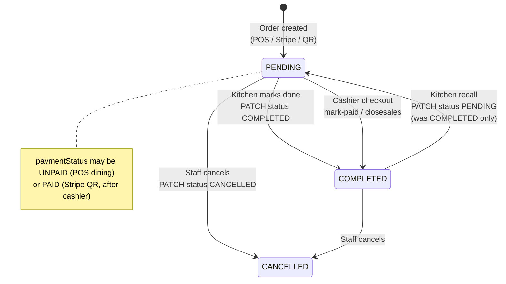

| Field | Values | Meaning |
| ----- | ------ | ------- |
| `status` | `PENDING` | Active in kitchen queue |
| `status` | `COMPLETED` | Food ready / order closed |
| `status` | `CANCELLED` | Voided |
| `paymentStatus` | `UNPAID` | Not yet settled at cashier |
| `paymentStatus` | `PAID` | Payment recorded |
| `paymentMethod` | `CASH`, `CARD_TERMINAL`, `STRIPE_QR` | Set when paid |

**Kitchen queue rule:** `GET /api/orders/pending` returns orders where `status = "PENDING"` regardless of payment.

---

## Flow: POS dining order

Waiter takes order at table via dashboard POS.

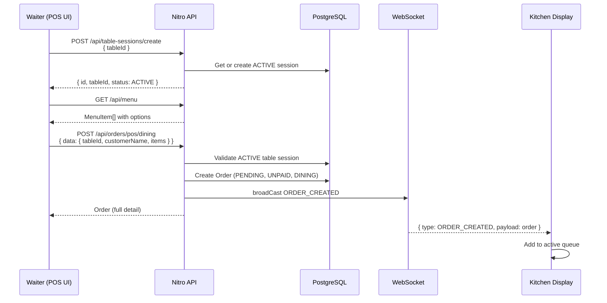

| Step | API | Result |
| ---- | --- | ------ |
| 1. Open table session | `POST /api/table-sessions/create` | ACTIVE session for table |
| 2. Load menu | `GET /api/menu` | Available items + options |
| 3. Submit order | `POST /api/orders/pos/dining` | Order in DB + kitchen broadcast |
| 4. Kitchen sees it | WebSocket `ORDER_CREATED` | Appears on kitchen screen |

---

## Flow: POS takeaway order

Same as dining but no table session required.

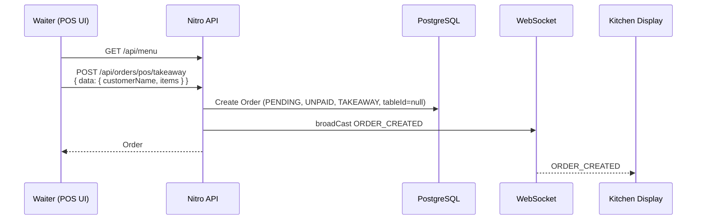

---

## Flow: Customer QR / Stripe self-order

Customer scans QR code on table → orders from phone → pays via Stripe.

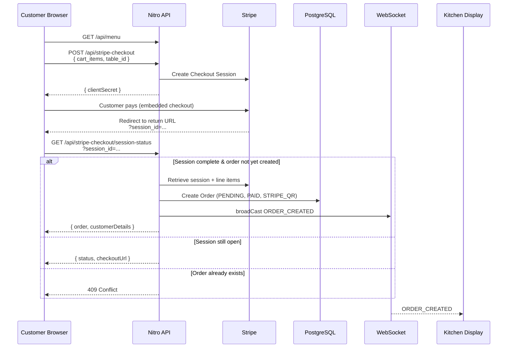

| Step | Detail |
| ---- | ------ |
| QR URL | `{BASE_URL}/order-table/{table_id}` |
| Return URL | `{BASE_URL}/order-table/checkout/return?session_id={CHECKOUT_SESSION_ID}` |
| Dedup | `checkoutSessionId` unique — prevents double order on refresh |
| Payment | Customer pays **before** kitchen sees order (`paymentStatus=PAID` at creation) |

---

## Flow: Kitchen display (REST + WebSocket)

The kitchen screen uses **hybrid sync** — REST for bootstrap, WebSocket for live updates.

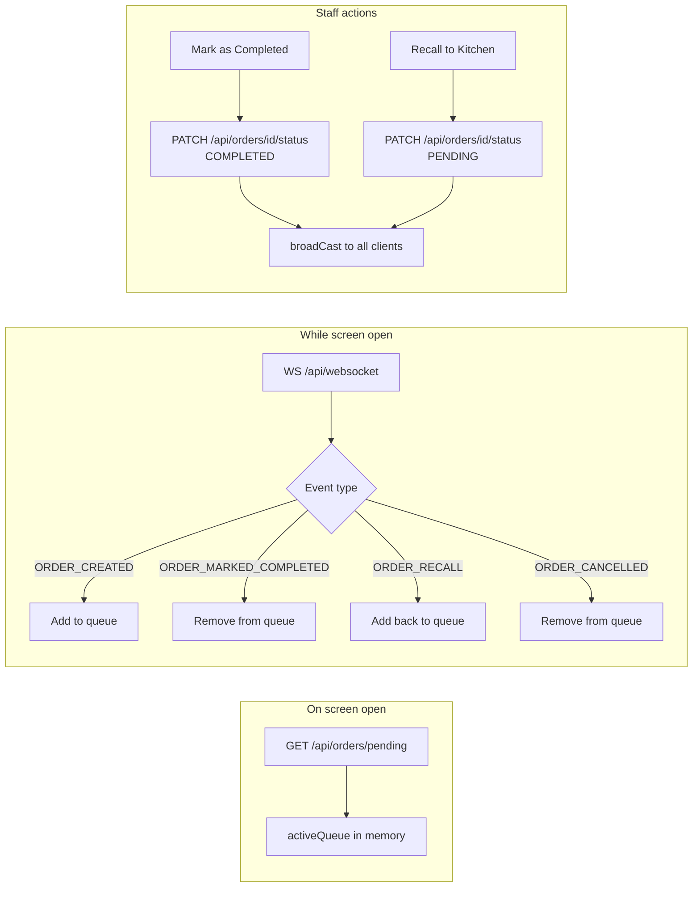

**Critical rule for native apps:** WebSocket URL must use the **same host** as REST API calls. See [WebSocket (real-time kitchen)](#websocket-real-time-kitchen) for full implementation guide.

---

## Flow: Cashier table checkout

Settle all unpaid orders for a table session and close the session.

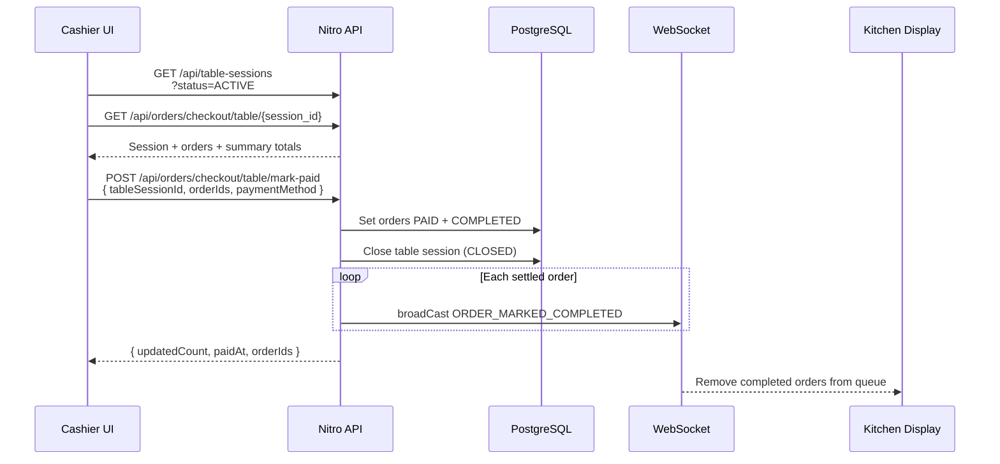

Optional: `POST /api/print-receipt/{session_id}` sends ESC/POS receipt to thermal printer.

---

## Flow: Cashier takeaway checkout

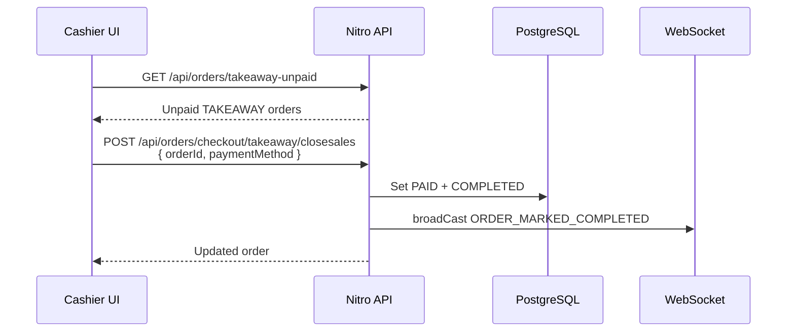

---

## Flow: Bookings (manual + Vapi voice)

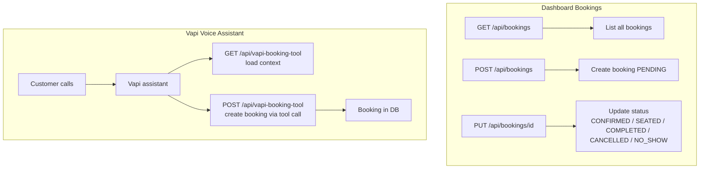

Booking status progression (typical): `PENDING` → `CONFIRMED` → `SEATED` → `COMPLETED`. Can jump to `CANCELLED` or `NO_SHOW` at any point.

---

## Flow: Table sessions

A **table session** groups all orders during one seating period.

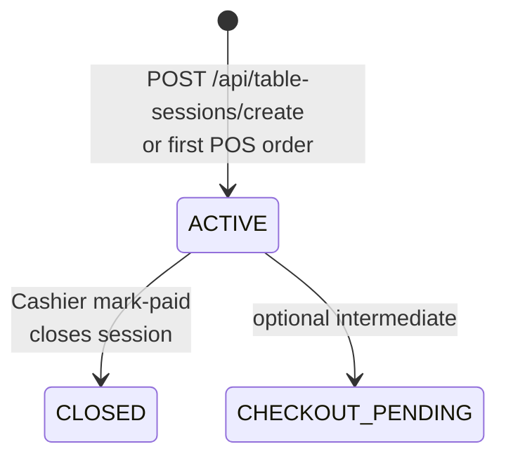

| API | Purpose |
| --- | ------- |
| `POST /api/table-sessions/create` | Get-or-create ACTIVE session for a table |
| `GET /api/table-sessions/active/{table_id}` | Current active session with orders |
| `GET /api/table-sessions/{session_id}` | Full session detail |
| `GET /api/table-sessions?status=ACTIVE` | List active sessions (cashier) |

---

## Flow: Staff, roster & leave

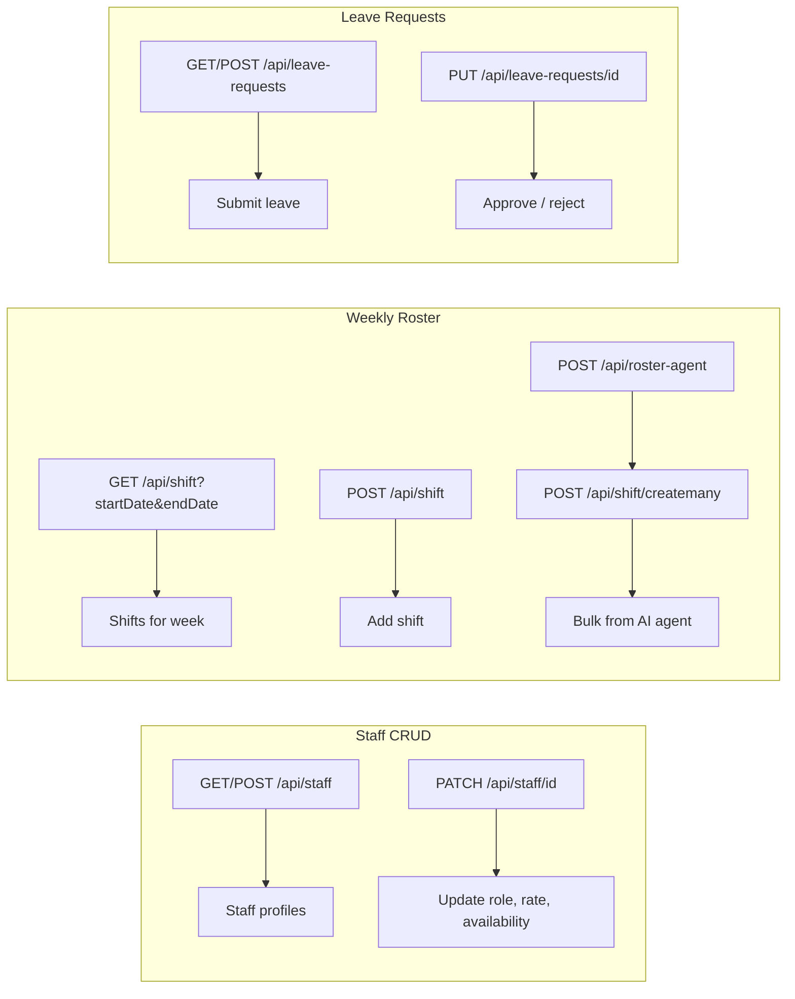

Staff images: upload to Cloudinary from client → save URL via `PATCH /api/staff/{id}` (`profile_photo_url`).

---

## Flow: Menu management

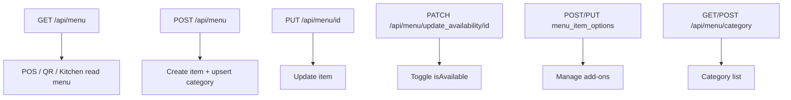

POS and QR ordering both read the same `GET /api/menu`. Setting `isAvailable=false` hides item from new orders.

---

## Flow: Stock management

REST-only (no WebSocket). CRUD on `StockItem` records.

| API | Action |
| --- | ------ |
| `GET /api/stock` | List all stock |
| `POST /api/stock` | Add item |
| `PUT /api/stock/{id}` | Update `currentStock` |
| `DELETE /api/stock/{id}` | Remove item |

QR label pages use `BASE_URL` to generate links to stock update pages.

---

## Flow: Dashboard analytics

All read-only aggregations under `GET /api/dashboard/stats/*`:

| Endpoint | Data |
| -------- | ---- |
| `weekly-kpi` | Revenue, order count, bookings, shift cost |
| `revenue-trend` | Chart series |
| `popular-items` | Top sellers |
| `soldbycategory` | Category breakdown |
| `recent-order` | Latest orders summary |
| `roster-overview` | Staff/shift/leave counts |

---

## Flow: AI agents

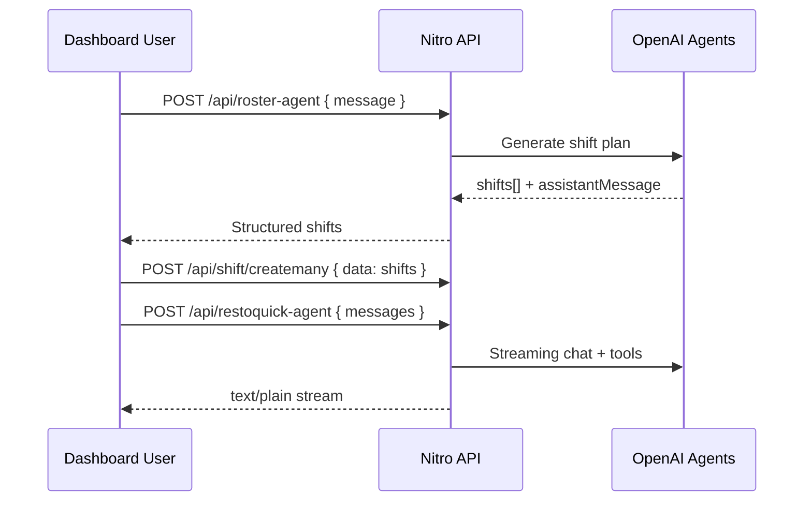

Requires `OPENAI_API_KEY`. Main assistant optionally uses `COMPOSIO_API_KEY` for MCP tools.

---

## Native app implementation guide

### Recommended screen → API mapping

| Native screen | Bootstrap APIs | Realtime | Mutation APIs |
| ------------- | -------------- | -------- | ------------- |
| **Kitchen display** | `GET /api/orders/pending`, `GET /api/orders/completed` | `WS /api/websocket` | `PATCH /api/orders/{id}/status` |
| **POS** | `GET /api/menu`, `GET /api/tables`, `POST /api/table-sessions/create` | — | `POST /api/orders/pos/dining`, `POST /api/orders/pos/takeaway` |
| **Cashier — tables** | `GET /api/table-sessions?status=ACTIVE`, checkout GET | — | `POST /api/orders/checkout/table/mark-paid` |
| **Cashier — takeaway** | `GET /api/orders/takeaway-unpaid` | — | `POST /api/orders/checkout/takeaway/closesales` |
| **Orders list** | `GET /api/orders?range=day` | — | `PATCH /api/orders/{id}/status`, order item mutations |
| **Bookings** | `GET /api/bookings` | — | `POST /api/bookings`, `PUT /api/bookings/{id}` |
| **Menu admin** | `GET /api/menu`, `GET /api/menu/category` | — | menu CRUD routes |
| **Staff / roster** | `GET /api/staff`, `GET /api/shift` | — | staff/shift/leave routes |
| **Dashboard home** | `GET /api/dashboard/stats/*` | — | — |

### Native client checklist

1. **Clerk auth** — sign in, attach token to all requests
2. **Same-origin WebSocket** — derive WS URL from REST base URL (see WebSocket section)
3. **Bootstrap then subscribe** — always REST-fetch before relying on WebSocket
4. **Optimistic UI** — update local state after successful PATCH; WebSocket confirms for other devices
5. **Reconnect strategy** — on WS disconnect, retry 3× then re-fetch pending orders
6. **Cents everywhere** — divide by 100 only for display
7. **Idempotent event handling** — check order `id` before add; filter before remove

### WebSocket URL helper

```ts
function kitchenWebSocketUrl(apiBaseUrl: string): string {
  const url = new URL(apiBaseUrl);
  url.protocol = url.protocol === "https:" ? "wss:" : "ws:";
  url.pathname = "/api/websocket";
  url.search = "";
  return url.toString();
}
```

---

## Feature → API quick map

| Feature | Key endpoints |
| ------- | ------------- |
| Create dining order | `POST /api/orders/pos/dining` |
| Create takeaway order | `POST /api/orders/pos/takeaway` |
| Customer QR pay | `POST /api/stripe-checkout` → `GET /api/stripe-checkout/session-status` |
| Kitchen queue | `GET /api/orders/pending` + `WS /api/websocket` |
| Mark food ready | `PATCH /api/orders/{id}/status` `{ "status": "COMPLETED" }` |
| Recall order | `PATCH /api/orders/{id}/status` `{ "status": "PENDING" }` |
| Pay table bill | `POST /api/orders/checkout/table/mark-paid` |
| Pay takeaway | `POST /api/orders/checkout/takeaway/closesales` |
| Open table | `POST /api/table-sessions/create` |
| Manage menu | `/api/menu/*` |
| Manage bookings | `/api/bookings/*` |
| Staff roster | `/api/staff/*`, `/api/shift/*`, `/api/leave-requests/*` |
| Stock | `/api/stock/*` |
| Analytics | `/api/dashboard/stats/*` |

---

# Part 2 — API reference

This section describes every HTTP API route exposed by the Nuxt/Nitro backend under `server/api/`. Enum values are taken from the authoritative Prisma schema (`prisma/schema.prisma`).

- Base URL: `<host>`
- Hosted (production) base URL: `https://restoquicknuxt-production.up.railway.app`
- Content type: `application/json` unless noted
- All routes are protected by Clerk auth middleware unless explicitly marked public (see [Authentication](#authentication)).

---

## Authentication

- A global server middleware (`server/middleware/auth.ts`) enforces **Clerk authentication** on `/api/*` routes.
- Unauthenticated requests to protected routes return **401 Unauthorized**.
- The native client must send a valid Clerk session token (via the Clerk mobile SDK / `Authorization` header as configured by Clerk).
- Some routes are designed for external callers (Vapi voice tool, Stripe webhooks/returns). Treat `vapi-booking-tool` as machine-to-machine.

---

## Conventions & data types

- **Money is always in integer cents.** Fields: `totalAmountCents`, `unitPriceCents`, `priceCents`. Example: `$10.50` → `1050`. Divide by 100 for display; never store dollars.
- **Dates** are ISO 8601 strings in requests and JSON responses (`DateTime` in Prisma).
- **IDs** are UUID strings unless noted (`orderNo` is an auto-increment integer).
- **File-based routing** maps to URLs: `index.get.ts` → `GET /resource`; `[id].put.ts` → `PUT /resource/{id}`.
- Prices `unitPriceCents`/`priceCents` are **snapshots** taken at order time.

---

## Enums

```ts
// Staff
type Role =
  | "Chef"
  | "Waiter"
  | "Bartender"
  | "Manager"
  | "Cook"
  | "Kitchen_Hand";
type EmploymentType = "PartTime" | "FullTime" | "Casual";
type WeekDay = "MON" | "TUE" | "WED" | "THU" | "FRI" | "SAT" | "SUN";

// Leave
type LeaveStatus = "pending" | "approved" | "rejected";

// Booking
type BookingStatus =
  | "PENDING"
  | "CONFIRMED"
  | "SEATED"
  | "COMPLETED"
  | "CANCELLED"
  | "NO_SHOW";

// Table sessions
type TableSessionStatus = "ACTIVE" | "CHECKOUT_PENDING" | "CLOSED";

// Orders
type OrderStatus = "PENDING" | "COMPLETED" | "CANCELLED";
type OrderType = "TAKEAWAY" | "DINING" | "UBER";
type PaymentStatus = "UNPAID" | "PAID";
type PaymentMethod = "CASH" | "CARD_TERMINAL" | "STRIPE_QR";

// Stock
type StockCategory = "INGREDIENTS" | "BEVERAGES" | "SUPPLIES" | "OTHER";
```

---

## Core models

```ts
interface Staff {
  id: string;
  firstname: string;
  lastName: string;
  role: Role;
  email: string; // unique
  phone: string;
  employmentType: EmploymentType;
  perHourRate: number; // Prisma Decimal (serialized as string/number)
  availability: WeekDay[];
  joined_date: string; // ISO
  profile_photo_url: string | null;
}

interface Shift {
  id: string;
  staffId: string;
  date: string; // ISO
  startTime: string; // e.g. "09:00"
  endTime: string; // e.g. "17:00"
  position: string;
}

interface LeaveRequest {
  id: string;
  staffId: string;
  startDate: string; // ISO
  endDate: string; // ISO
  reason: string;
  status: LeaveStatus; // default "pending"
  submittedAt: string; // ISO
}

interface Table {
  id: string;
  number: string; // unique, e.g. "A1", "12"
  capacity: number;
}

interface TableSession {
  id: string;
  status: TableSessionStatus; // default "ACTIVE"
  openedAt: string;
  closedAt: string | null;
  createdAt: string;
  updatedAt: string;
  tableId: string;
}

interface Booking {
  id: string;
  customerName: string;
  customerPhone: string;
  bookingTime: string; // ISO (date + time combined)
  guestCount: number;
  specialRequest: string | null;
  status: BookingStatus; // default "PENDING"
  tableId: string | null;
  createdAt: string;
  updatedAt: string;
}

interface MenuCategory {
  id: string;
  name: string; // unique
  createdAt: string;
  updatedAt: string;
}

interface MenuItem {
  id: string;
  name: string;
  description: string | null;
  priceCents: number;
  category: string; // FK -> MenuCategory.name
  imageUrl: string | null;
  isAvailable: boolean; // default true
  options?: MenuOption[];
}

interface MenuOption {
  id: string;
  name: string;
  priceCents: number; // default 0
  menuItemId: string;
}

interface Order {
  id: string;
  orderNo: number; // auto-increment, unique
  checkoutSessionId: string; // unique (prevents duplicate orders)
  status: OrderStatus; // default "PENDING"
  totalAmountCents: number; // default 0
  paymentStatus: PaymentStatus; // default "UNPAID"
  paymentMethod: PaymentMethod | null;
  paidAt: string | null;
  orderType: OrderType; // default "DINING"
  customerName: string;
  tableId: string | null;
  tableSessionId: string | null;
  items?: OrderItem[];
  createdAt: string;
  updatedAt: string;
}

interface OrderItem {
  id: string;
  itemName: string;
  quantity: number; // default 1
  unitPriceCents: number; // snapshot
  specialInstructions: string | null;
  orderId: string;
  menuItemId: string | null;
  orderItemOptions?: OrderItemOption[];
  createdAt: string;
  updatedAt: string;
}

interface OrderItemOption {
  id: string;
  quantity: number; // default 1
  name: string;
  priceCents: number;
  orderItemId: string;
  menuOptionId: string | null;
}

interface StockItem {
  id: string;
  name: string;
  category: StockCategory; // default "INGREDIENTS"
  currentStock: number; // default 0
  unit: string; // "kg", "liters", "pieces"
  reorderLevel: number;
  reorderQuantity: number;
  supplier: string | null;
  lastRestocked: string;
  createdAt: string;
  updatedAt: string;
}
```

---

## WebSocket (real-time kitchen)

This section is the **authoritative guide** for implementing the kitchen display realtime layer in a native mobile client (iOS, Android, React Native, etc.). The web app uses the same contract.

### Overview

The kitchen display uses a **hybrid REST + WebSocket** pattern:

1. **Initial load (REST):** fetch the current order list from the database.
2. **Live updates (WebSocket):** apply incremental changes pushed by the server when orders are created or their status changes elsewhere (POS, cashier, Stripe QR, kitchen buttons, orders dashboard).

The WebSocket channel is **kitchen-specific**. It broadcasts order lifecycle events only — not menu, stock, bookings, or other domains.

```
┌─────────────────┐     REST (bootstrap)      ┌──────────────────┐
│  Native client  │ ─────────────────────────►│  Nitro HTTP API  │
│  (kitchen UI)   │   GET /api/orders/pending │  + Prisma/DB     │
└────────┬────────┘                           └────────┬─────────┘
         │                                             │
         │  WS connect                                 │  HTTP handlers
         │  wss://<host>/api/websocket                 │  call broadCast()
         ▼                                             ▼
┌─────────────────┐   JSON events (see below)  ┌──────────────────┐
│  WebSocket      │ ◄──────────────────────────│  kitchenSocket   │
│  connection     │                            │  (in-memory peers)│
└─────────────────┘                            └──────────────────┘
```

### Connection

| Item               | Value                                                                                                                                                                                                                                                       |
| ------------------ | ----------------------------------------------------------------------------------------------------------------------------------------------------------------------------------------------------------------------------------------------------------- |
| **Endpoint**       | `WS /api/websocket`                                                                                                                                                                                                                                         |
| **Production URL** | `wss://restoquicknuxt-production.up.railway.app/api/websocket`                                                                                                                                                                                              |
| **Local dev URL**  | `ws://localhost:3000/api/websocket`                                                                                                                                                                                                                         |
| **URL rule**       | Derive from the same **host** used for REST. Convert `https://` → `wss://`, `http://` → `ws://`, then append `/api/websocket`. Do **not** use a separate websocket host unless it is guaranteed to be the same server process that handles your REST calls. |

**Why same-host matters:** broadcasts are stored in an **in-memory peer set** on the server instance that handled the HTTP request. If the native app calls REST on `localhost:3000` but connects WebSocket to production, it will never receive local broadcasts.

**Native URL example (Swift/Kotlin pseudocode):**

```ts
function kitchenWebSocketUrl(apiBaseUrl: string): string {
  const url = new URL(apiBaseUrl);
  url.protocol = url.protocol === "https:" ? "wss:" : "ws:";
  url.pathname = "/api/websocket";
  url.search = "";
  url.hash = "";
  return url.toString();
}
// kitchenWebSocketUrl("https://restoquicknuxt-production.up.railway.app")
// → "wss://restoquicknuxt-production.up.railway.app/api/websocket"
```

### Authentication

- All REST routes under `/api/*` require a valid **Clerk session** (401 if missing).
- The WebSocket route is `/api/websocket`. Pass the same Clerk session token your native app uses for REST (typically as an `Authorization: Bearer <token>` header on the WebSocket upgrade request, depending on your WebSocket library).
- If the connection fails with 401, refresh the Clerk session and reconnect.

### Server implementation (reference)

These files implement the channel on the backend. A native client does not need to replicate them, but understanding them explains message timing and payload shape.

| File                            | Role                                                                                                                                          |
| ------------------------------- | --------------------------------------------------------------------------------------------------------------------------------------------- |
| `server/api/websocket.ts`       | WebSocket handler (Nitro experimental + `crossws`). Registers each client as a peer and subscribes it to room `"KITCHEN"`. Handles heartbeat. |
| `server/utils/kitchenSocket.ts` | In-memory `Set` of connected peers. `broadCast(data)` iterates all peers and `send(JSON.stringify(data))`.                                    |
| `nuxt.config.ts`                | `nitro.experimental.websocket: true` enables the handler.                                                                                     |

**Heartbeat (client → server):**

- Client sends the plain-text string `"ping"` every **30 seconds** (recommended).
- Server replies with plain-text `"pong"`.
- Ignore `"pong"` in your event handler — it is not JSON.
- Recommended timeouts (matching the web client): ping interval **30s**, pong timeout **20s**, auto-reconnect with backoff.

**Server handler behaviour (`server/api/websocket.ts`):**

```ts
// On connect: add peer to in-memory set, subscribe to "KITCHEN" room
// On message "ping": reply "pong"
// On close: remove peer from set
```

### Message format

Every broadcast is a **single JSON text frame** (not binary):

```ts
interface WebSocketPayload {
  type: SocketEventType;
  payload: OrderDetailsWithInclude;
}

type SocketEventType =
  | "ORDER_CREATED"
  | "ORDER_MARKED_COMPLETED"
  | "ORDER_RECALL"
  | "ORDER_CANCELLED";
```

**`OrderDetailsWithInclude`** is the full order object returned by order APIs, always including:

```ts
interface OrderDetailsWithInclude extends Order {
  table: Table | null;
  items: (OrderItem & {
    menuItem: MenuItem | null;
    orderItemOptions: OrderItemOption[];
  })[];
}
```

Money fields remain in **cents**. Dates are ISO 8601 strings.

**Example broadcast:**

```json
{
  "type": "ORDER_MARKED_COMPLETED",
  "payload": {
    "id": "550e8400-e29b-41d4-a716-446655440000",
    "orderNo": 42,
    "status": "COMPLETED",
    "orderType": "DINING",
    "customerName": "Jane Doe",
    "totalAmountCents": 3250,
    "paymentStatus": "UNPAID",
    "paymentMethod": null,
    "paidAt": null,
    "tableId": "...",
    "tableSessionId": "...",
    "checkoutSessionId": "pos_...",
    "createdAt": "2026-07-10T12:00:00.000Z",
    "updatedAt": "2026-07-10T12:15:00.000Z",
    "table": { "id": "...", "number": "A1", "capacity": 4 },
    "items": [
      {
        "id": "...",
        "itemName": "Margherita Pizza",
        "quantity": 2,
        "unitPriceCents": 1500,
        "specialInstructions": "Extra basil",
        "menuItem": {
          /* ... */
        },
        "orderItemOptions": []
      }
    ]
  }
}
```

### Event catalogue — when each event is broadcast

| Event                    | Triggered by (HTTP route)                                                                                          | DB change                                                 | Typical source                                |
| ------------------------ | ------------------------------------------------------------------------------------------------------------------ | --------------------------------------------------------- | --------------------------------------------- |
| `ORDER_CREATED`          | `POST /api/orders/pos/dining`                                                                                      | New order, `status = "PENDING"`                           | POS dining order                              |
| `ORDER_CREATED`          | `POST /api/orders/pos/takeaway`                                                                                    | New order, `status = "PENDING"`                           | POS takeaway order                            |
| `ORDER_CREATED`          | `GET /api/stripe-checkout/session-status?session_id=...` (on first successful completion)                          | New order, `status = "PENDING"`, `paymentStatus = "PAID"` | Customer QR/Stripe self-order                 |
| `ORDER_MARKED_COMPLETED` | `POST /api/orders/checkout/table/mark-paid`                                                                        | `status = "COMPLETED"`, `paymentStatus = "PAID"`          | Cashier table checkout                        |
| `ORDER_MARKED_COMPLETED` | `POST /api/orders/checkout/takeaway/closesales`                                                                    | `status = "COMPLETED"`, `paymentStatus = "PAID"`          | Cashier takeaway checkout                     |
| `ORDER_MARKED_COMPLETED` | `PATCH /api/orders/{order_id}/status` with `{ "status": "COMPLETED" }`                                             | `status = "COMPLETED"`                                    | Kitchen "Mark as Completed", orders dashboard |
| `ORDER_RECALL`           | `PATCH /api/orders/{order_id}/status` with `{ "status": "PENDING" }` **only when previous status was `COMPLETED`** | `status = "PENDING"`                                      | Kitchen "Recall to Kitchen"                   |
| `ORDER_CANCELLED`        | `PATCH /api/orders/{order_id}/status` with `{ "status": "CANCELLED" }`                                             | `status = "CANCELLED"`                                    | Orders dashboard cancel                       |

**Important:** changing status to `PENDING` from a non-`COMPLETED` state does **not** broadcast. Only the completed → pending transition emits `ORDER_RECALL`.

Broadcasts are **best-effort** — failures are logged server-side but do not roll back the DB write.

### REST endpoints used with WebSocket (kitchen screen)

These REST calls bootstrap and mutate state; WebSocket keeps all connected clients in sync.

| Purpose                          | Method  | Endpoint                        | Notes                                                                                          |
| -------------------------------- | ------- | ------------------------------- | ---------------------------------------------------------------------------------------------- |
| Load active kitchen queue        | `GET`   | `/api/orders/pending`           | All orders where `status = "PENDING"`. Call on screen open and on pull-to-refresh.             |
| Load completed orders (last 24h) | `GET`   | `/api/orders/completed`         | All orders where `status = "COMPLETED"` and `createdAt` within 24 hours.                       |
| Mark order complete (kitchen)    | `PATCH` | `/api/orders/{order_id}/status` | Body: `{ "status": "COMPLETED" }`. Returns updated order. Broadcasts `ORDER_MARKED_COMPLETED`. |
| Recall order to kitchen          | `PATCH` | `/api/orders/{order_id}/status` | Body: `{ "status": "PENDING" }`. Only broadcasts `ORDER_RECALL` if order was `COMPLETED`.      |
| Cancel order                     | `PATCH` | `/api/orders/{order_id}/status` | Body: `{ "status": "CANCELLED" }`. Broadcasts `ORDER_CANCELLED`.                               |

### Native client implementation guide

Implement **two data sources** that merge into local UI state:

#### Step 1 — Bootstrap on screen open

```
GET /api/orders/pending          → activeQueue: OrderDetailsWithInclude[]
GET /api/orders/completed        → completedQueue: OrderDetailsWithInclude[]  (optional, for completed tab/modal)
```

Store both in local state (in-memory, ViewModel, Redux, etc.).

#### Step 2 — Open WebSocket and listen

```
connect wss://<host>/api/websocket
start heartbeat timer (send "ping" every 30s)
on message:
  if text == "pong": ignore
  else: parse JSON as WebSocketPayload
  apply event to local state (see table below)
```

#### Step 3 — Apply events to local state

This mirrors the web reference implementation (`app/composables/useKitchenOrderEvents.ts`).

| Event                    | Active queue (`pending`)                               | Completed list (24h)                                             |
| ------------------------ | ------------------------------------------------------ | ---------------------------------------------------------------- |
| `ORDER_CREATED`          | **Add** `payload` to end (skip if `id` already exists) | No change                                                        |
| `ORDER_MARKED_COMPLETED` | **Remove** order where `id === payload.id`             | **Prepend** `payload` if within last 24h and not already present |
| `ORDER_RECALL`           | **Add** `payload` (skip duplicates)                    | **Remove** order where `id === payload.id`                       |
| `ORDER_CANCELLED`        | **Remove** order where `id === payload.id`             | **Remove** order where `id === payload.id`                       |

**24-hour filter for completed list (client-side):**

```ts
function isWithinLast24Hours(createdAt: string): boolean {
  return Date.now() - new Date(createdAt).getTime() <= 24 * 60 * 60 * 1000;
}
```

#### Step 4 — Optimistic UI on user actions

When the user taps **Mark as Completed** or **Recall**, update local state **immediately** after a successful REST response, without waiting for the WebSocket echo. The broadcast will arrive shortly after and should be idempotent (same add/remove logic handles duplicates).

```
User taps "Mark as Completed"
  → PATCH /api/orders/{id}/status  { status: "COMPLETED" }
  → on 200: remove from activeQueue locally
  → WebSocket ORDER_MARKED_COMPLETED arrives → remove again (no-op)

User taps "Recall to Kitchen"
  → PATCH /api/orders/{id}/status  { status: "PENDING" }
  → on 200: remove from completedQueue, add to activeQueue
  → WebSocket ORDER_RECALL arrives → same (idempotent)
```

#### Step 5 — Reconnection strategy

```
on disconnect:
  retry up to 3 times with 1s delay
  on reconnect success:
    re-fetch GET /api/orders/pending (and /completed if visible)
    resume heartbeat
  on permanent failure:
    show "Not Connected" UI; allow manual refresh
```

After reconnect, **always re-bootstrap via REST** to heal any missed events.

### End-to-end sequence examples

**New POS order appears on kitchen display:**

```
POS app          Server                    Kitchen client
  │                │                            │
  │ POST /pos/     │                            │
  │ dining         │                            │
  ├───────────────►│ create order (PENDING)     │
  │                │ broadCast(ORDER_CREATED)   │
  │◄───────────────┤                            │
  │   201 + order  │ ─── WS JSON frame ────────►│ add to activeQueue
  │                │                            │
```

**Kitchen marks order complete:**

```
Kitchen client   Server                    Other kitchen clients
  │                │                            │
  │ PATCH status   │                            │
  │ COMPLETED      │                            │
  ├───────────────►│ update DB                  │
  │                │ broadCast(ORDER_MARKED_     │
  │                │   COMPLETED)               │
  │◄───────────────┤                            │
  │ 200 + order    │ ─── WS JSON frame ────────►│ remove from activeQueue
  │ (also update   │                            │
  │  locally)      │                            │
```

### Connection status UI

The web client exposes three states derived from the WebSocket library:

| State        | Meaning                     | Suggested native UI            |
| ------------ | --------------------------- | ------------------------------ |
| `CONNECTING` | Handshake in progress       | Gray indicator, "Connecting…"  |
| `OPEN`       | Connected, heartbeat active | Green indicator, "Connected"   |
| `CLOSED`     | Disconnected                | Red indicator, "Not Connected" |

### Limitations and production notes

1. **In-memory broadcasting:** peers are stored in a process-local `Set`. All connected clients on the **same server instance** receive events. If the backend is scaled to multiple replicas without a shared pub/sub layer, clients on different instances may miss events. Mitigation: re-fetch `/api/orders/pending` on reconnect and on app foreground.
2. **No historical replay:** WebSocket only pushes live events. There is no backlog — bootstrap via REST is mandatory.
3. **No client → server events:** clients only send `"ping"`. Order mutations always go through REST; the server broadcasts to all peers after the DB write.
4. **Stripe QR orders:** `ORDER_CREATED` fires when `GET /api/stripe-checkout/session-status` creates the order after payment — not at cart submission time.
5. **Cashier completion vs kitchen completion:** table/takeaway checkout sets both `COMPLETED` and `PAID`. Kitchen "Mark as Completed" sets `COMPLETED` only (payment may still be `UNPAID` for dining orders).

### Reference: web client files

| File                                                                                 | Purpose                                                     |
| ------------------------------------------------------------------------------------ | ----------------------------------------------------------- |
| `app/composables/useKitchenWebSocket.ts`                                             | WebSocket URL (same-origin), heartbeat, `onMessage` parsing |
| `app/composables/useKitchenOrderEvents.ts`                                           | Event → state mutation mapping                              |
| `app/pages/Dashboard/kitchen/index.vue`                                              | Active queue screen                                         |
| `app/components/kitchenDisplay_components/Completed_Orders/Complete_Order_Popup.vue` | Completed orders modal                                      |
| `types/websocket_payload.ts`                                                         | Event type definitions                                      |

### Minimal native pseudocode (complete kitchen screen)

```ts
class KitchenScreen {
  activeQueue: Order[] = [];
  ws: WebSocket;
  heartbeat?: Timer;

  async onAppear() {
    this.activeQueue = await api.get("/api/orders/pending");
    this.ws = new WebSocket(kitchenWebSocketUrl(API_BASE_URL));
    this.ws.onmessage = (e) => this.handleMessage(String(e.data));
    this.ws.onopen = () => {
      this.heartbeat = setInterval(() => this.ws.send("ping"), 30_000);
    };
    this.ws.onclose = () => this.scheduleReconnect();
  }

  handleMessage(raw: string) {
    if (raw === "pong") return;
    const event = JSON.parse(raw) as WebSocketPayload;
    switch (event.type) {
      case "ORDER_CREATED":
        if (!this.activeQueue.find((o) => o.id === event.payload.id))
          this.activeQueue.push(event.payload);
        break;
      case "ORDER_MARKED_COMPLETED":
      case "ORDER_CANCELLED":
        this.activeQueue = this.activeQueue.filter(
          (o) => o.id !== event.payload.id,
        );
        break;
      case "ORDER_RECALL":
        if (!this.activeQueue.find((o) => o.id === event.payload.id))
          this.activeQueue.push(event.payload);
        break;
    }
    this.render();
  }

  async markComplete(orderId: string) {
    await api.patch(`/api/orders/${orderId}/status`, { status: "COMPLETED" });
    this.activeQueue = this.activeQueue.filter((o) => o.id !== orderId);
    this.render();
  }
}
```

---

## Bookings

### `GET /api/bookings`

List all bookings (includes related `table`).

- **Response:** `Booking[]` (each with `table: Table | null`)

### `POST /api/bookings`

Create a booking.

- **Body:**
  ```ts
  { booking: { customerName: string; customerPhone: string; guestCount: number; bookingTime: string; specialRequest?: string } }
  ```
- **Response:** `Booking`

### `PUT /api/bookings/{booking-id}`

Update a booking's status.

- **Path:** `booking-id: string`
- **Body:** `{ status: BookingStatus }`
- **Response:** `Booking`

---

## Dashboard stats

All require auth. Aggregations are over the last 30 days or the current week/day depending on the endpoint.

### `GET /api/dashboard/stats/popular-items`

- **Response:** `{ name: string; sold_quantity: number }[]`

### `GET /api/dashboard/stats/recent-order`

- **Response:**
  ```ts
  {
    id: string;
    orderNo: number | null;
    customerName: string;
    status: OrderStatus;
    orderType: OrderType;
    totalAmountCents: number;
    createdAt: string;
    tableNumber: string | null;
    itemCount: number;
  }
  [];
  ```

### `GET /api/dashboard/stats/revenue-trend`

- **Response:** revenue series for charting (daily/weekly aggregation).

### `GET /api/dashboard/stats/roster-overview`

- **Query:** `startDate?`, `endDate?` (ISO; default current week)
- **Response:**
  ```ts
  {
    totalStaff: number;
    weeklyShiftCount: number;
    pendingLeaveRequests: number;
    startDate: string;
    endDate: string;
  }
  ```

### `GET /api/dashboard/stats/soldbycategory`

- **Response:** `{ category: string; percentage: number }[]` (sorted desc)

### `GET /api/dashboard/stats/weekly-kpi`

- **Response:**
  ```ts
  {
    revenueCents: number;
    weeklyOrderCount: number;
    todayBookingsCount: number;
    weeklyShiftCostCents: number;
    startofWeek: string;
    endOfWeek: string;
  }
  ```

---

## Leave requests

### `GET /api/leave-requests`

- **Response:** `LeaveRequest[]` (includes `staff`), ordered by `submittedAt` desc

### `POST /api/leave-requests`

- **Body:** `{ staffId: string; startDate: string; endDate: string; reason: string; status?: LeaveStatus }`
- **Response:** `LeaveRequest`

### `PUT /api/leave-requests/{request_id}`

- **Path:** `request_id: string`
- **Body:** `{ status: LeaveStatus }`
- **Response:** `LeaveRequest`

### `DELETE /api/leave-requests/{request_id}`

- **Path:** `request_id: string`
- **Response:** deleted `LeaveRequest`

---

## Menu

### `GET /api/menu`

- **Response:** `MenuItem[]` (includes `options`), ordered by category then name

### `POST /api/menu`

- **Body:**
  ```ts
  { name: string; category: string; priceCents: number; description?: string; imageUrl?: string; isAvailable?: boolean; options?: MenuOption[] }
  ```
- **Side effect:** upserts `MenuCategory` if missing
- **Response:** `{ options: MenuOption[] }`
- **Errors:** `400` if `name`, `category`, or `priceCents` missing

### `PUT /api/menu/{menu_id}`

- **Path:** `menu_id: string`
- **Body:** same as POST (`name`, `category`, `priceCents` required)
- **Response:** updated `MenuItem`

### `DELETE /api/menu/{menu_id}`

- **Path:** `menu_id: string`
- **Response:** deleted `MenuItem`

### `GET /api/menu/category`

- **Response:** `string[]` (category names, asc)

### `POST /api/menu/category`

- **Body:** `{ name: string }`
- **Response:** `{ name: string }`
- **Errors:** `400` if name empty

### `POST /api/menu/menu_item_options`

- **Body:** `{ create_menu_option: { menuItemId: string; name: string; priceCents: number } }`
- **Response:** `MenuOption`

### `PUT /api/menu/menu_item_options/{option_id}`

- **Path:** `option_id: string`
- **Body:** `{ update_menu_option: { name: string; priceCents: number } }`
- **Response:** updated `MenuOption`
- **Errors:** `400` if `name` or `priceCents` missing

### `PATCH /api/menu/update_availability/{menu_item_id}`

- **Path:** `menu_item_id: string`
- **Body:** `{ isAvailable: boolean }`
- **Response:** updated `MenuItem`
- **Errors:** `400` if `isAvailable` not boolean

---

## Orders

Order responses include `table`, `items` (with `menuItem` and `orderItemOptions` → `menuOption`).

### `GET /api/orders`

- **Query:**
  - `range?`: `"all" | "day" | "week" | "month"` (default `all`)
  - `customer?` / `customerName?`: case-insensitive search
- **Response:** `Order[]` ordered by `createdAt` desc

### `GET /api/orders/{order_id}`

- **Path:** `order_id: string`
- **Response:** `Order` (full detail)
- **Errors:** `404` if not found

### `PATCH /api/orders/{order_id}/status`

Update an order's kitchen lifecycle status. **Broadcasts a WebSocket event** to all connected kitchen clients (see [WebSocket (real-time kitchen)](#websocket-real-time-kitchen)).

- **Path:** `order_id: string`
- **Body:** `{ status: OrderStatus }` (`status` is required)
- **Response:** updated `OrderDetailsWithInclude` (includes `table`, `items` with `menuItem` and `orderItemOptions`)
- **WebSocket side effects:**
  - `"COMPLETED"` → broadcasts `ORDER_MARKED_COMPLETED`
  - `"CANCELLED"` → broadcasts `ORDER_CANCELLED`
  - `"PENDING"` when previous status was `"COMPLETED"` → broadcasts `ORDER_RECALL`
  - `"PENDING"` from any other previous status → no broadcast
- **Errors:** `400` if `status` missing · `404` if order not found

### `GET /api/orders/pending`

- **Response:** `Order[]` where `status = "PENDING"`

### `GET /api/orders/completed`

- **Response:** `Order[]` where `status = "COMPLETED"` in the last 24 hours

### `GET /api/orders/takeaway-unpaid`

- **Response:** `Order[]` where `orderType = "TAKEAWAY"` and `paymentStatus = "UNPAID"`

---

## Order items

All mutations below recompute the parent order's `totalAmountCents`.

### `DELETE /api/orders/items/{item_id}`

- **Response:** `{ success: true }`

### `PATCH /api/orders/items/{item_id}/quantity`

- **Body:** `{ quantity: number }` (integer ≥ 1)
- **Response:** `{ success: true }`

### `PATCH /api/orders/items/{item_id}/special-instructions`

- **Body:** `{ specialInstructions?: string | null }` (trimmed; empty → null)
- **Response:** `{ success: true }`

### `DELETE /api/orders/items/{item_id}/options/{option_id}`

- **Response:** `{ success: true }`

### `PATCH /api/orders/items/{item_id}/options/{option_id}/quantity`

- **Body:** `{ quantity: number }` (integer ≥ 1)
- **Response:** `{ success: true }`

---

## Order checkout

### `GET /api/orders/checkout/table/{session_id}`

Checkout summary for a table session.

- **Path:** `session_id: string`
- **Response:**
  ```ts
  TableSession & {
    orders: Order[];
    summary: {
      orderCount: number;
      payableOrderCount: number;
      paidOrderCount: number;
      payableOrderIds: string[];
      sessionTotalCents: number;
      payableTotalCents: number;
      paidTotalCents: number;
      hasOutstandingBalance: boolean;
    };
  }
  ```

### `GET /api/orders/checkout/table/{table_id}`

Unpaid completed orders for a table.

- **Path:** `table_id: string`
- **Response:** `{ tableId: string; orderCount: number; totalDueCents: number; orders: Order[] }`

### `POST /api/orders/checkout/table/mark-paid`

Mark selected orders as paid and close the session.

- **Body:** `{ tableSessionId: string; orderIds: string[]; paymentMethod: PaymentMethod }`
- **Response:** `{ updatedCount: number; paidAt: string; paymentMethod: PaymentMethod; orderIds: string[] }`
- **Side effects:** sets `paymentStatus="PAID"`, `status="COMPLETED"`, `paidAt`; closes the table session; broadcasts `ORDER_MARKED_COMPLETED`
- **Errors:** `400` if no `orderIds` or no unpaid orders found

### `POST /api/orders/checkout/takeaway/closesales`

Close a takeaway order.

- **Body:** `{ orderId: string; paymentMethod?: PaymentMethod }` (defaults `CASH`)
- **Response:** updated `Order` (full detail)
- **Constraints:** only `TAKEAWAY` orders; cannot re-pay a paid order
- **Side effects:** sets paid/completed; broadcasts `ORDER_MARKED_COMPLETED`

---

## POS orders

### `POST /api/orders/pos/dining`

Create a dining order from the POS.

- **Body:**
  ```ts
  { data: { tableId: string; customerName: string; items: { create: OrderItemCreateInput[] } /* + other order fields */ } }
  ```
- **Response:** `Order` (with items, menuItem, options, table)
- **Side effects:** requires an ACTIVE session for the table; sets `orderType="DINING"`, `paymentStatus="UNPAID"`; generates `checkoutSessionId = "pos_<uuid>"`; broadcasts `ORDER_CREATED`
- **Errors:** `403` if no active table session

### `POST /api/orders/pos/takeaway`

Create a takeaway order from the POS.

- **Body:** same as dining but without `tableId`
- **Response:** `Order`
- **Side effects:** sets `orderType="TAKEAWAY"`, `tableId=null`; broadcasts `ORDER_CREATED`
- **Errors:** `400` if `customerName` or `items` missing

---

## Receipt printing

### `POST /api/print-receipt/{session_id}`

Print a table-session receipt to an ESC/POS thermal printer over TCP.

- **Path:** `session_id: string`
- **Body:** `{ printerIp: string }` (IPv4, optional port, e.g. `"192.168.1.100"` or `"192.168.1.100:9100"`)
- **Response:** `{ ok: boolean; sessionId: string; printerTarget: string; itemCount: number; totalCents: number }`
- **Errors:** `400` missing params · `404` session not found · `503` printer not connected · `500` print failure

---

## Shifts

### `GET /api/shift`

- **Query:** `startDate` (required, ISO), `endDate` (required, ISO)
- **Response:** `Shift[]` (includes `staff`), ordered by date asc

### `POST /api/shift`

- **Body:** `{ staffId: string; date: string; startTime: string; endTime: string; position?: string }`
- **Response:** `{ response: Shift }`

### `POST /api/shift/createmany`

- **Body:** `{ data: Shift[] }`
- **Response:** `{ response: { count: number } }`

### `GET /api/shift/{shiftId}`

- **Response:** `Shift` (includes `staff`)

### `PUT /api/shift/{shiftId}`

- **Body:** partial shift fields (`date`, `startTime`, `endTime`, `position`)
- **Response:** updated `Shift`

### `DELETE /api/shift/{shiftId}`

- **Response:** deleted `Shift`

---

## Staff

### `GET /api/staff`

- **Query:** `staff_name?` (case-insensitive match on firstname/lastName)
- **Response:** `Staff[]` ordered by firstname asc

### `POST /api/staff`

- **Body:** `{ staff: { firstname: string; lastName: string; email: string; phone: string; role: Role; perHourRate: number; employmentType?: EmploymentType; availability?: WeekDay[] } }`
- **Response:** `Staff`

### `GET /api/staff/{staffId}`

- **Path:** `staffId: string`
- **Query:** `startDate?`, `endDate?` (ISO — filter shifts)
- **Response:**
  ```ts
  Staff & { shifts: Shift[]; leaveRequests: LeaveRequest[] /* pending only */ }
  ```

### `PATCH /api/staff/{staffId}`

- **Body:** partial `Staff` fields
- **Response:** updated `Staff`
- **Errors:** `400` on failure

### `DELETE /api/staff/{staffId}`

- **Response:** deleted `Staff`
- **Errors:** `400` if `staffId` missing

### `DELETE /api/staff`

Bulk/alt delete by body.

- **Body:** `{ id?: string; staffId?: string }`
- **Response:** deleted `Staff`
- **Errors:** `400` if no id provided

### `POST /api/staff/upload-profile-picture`

- Stub / not implemented. Profile images are typically uploaded to Cloudinary from the client and the resulting URL saved via `PATCH /api/staff/{staffId}` (`profile_photo_url`).

---

## Stock

### `GET /api/stock`

- **Response:** `StockItem[]` ordered by `createdAt` desc

### `POST /api/stock`

- **Body:** `{ name: string; category?: StockCategory; currentStock?: number; unit: string; reorderLevel: number; reorderQuantity: number; supplier?: string }`
- **Response:** `StockItem`

### `GET /api/stock/{id}`

- **Response:** `StockItem`
- **Errors:** `400` missing id · `404` not found

### `PUT /api/stock/{id}`

- **Body:** `{ currentStock: number }`
- **Response:** updated `StockItem`
- **Errors:** `400` missing id

### `DELETE /api/stock/{id}`

- **Response:** deleted `StockItem`
- **Errors:** `400` missing id

---

## Stripe checkout

Used for QR self-order flow (customer pays via Stripe embedded checkout).

### `POST /api/stripe-checkout`

- **Body:**
  ```ts
  {
    cart_items: {
      itemName: string;
      menuItemId: string;
      unitPrice: number;      // cents
      quantity: number;
      specialInstructions?: string;
    }[];
    table_id: string;
  }
  ```
- **Response:** `{ clientSecret: string }` (Stripe embedded checkout client secret)
- Currency: AUD. `table_id` stored in session metadata.

### `GET /api/stripe-checkout/session-status`

- **Query:** `session_id: string`
- **Response (complete):** `{ order: Order; customerDetails: { email: string | null; name: string } }`
- **Response (open):** `{ status: string; checkoutUrl: string }`
- **Side effects (on completion):** creates `Order` (paid/completed, `paymentMethod="STRIPE_QR"`), broadcasts `ORDER_CREATED`, dedupes by `checkoutSessionId`
- **Errors:** `409` order already created · `410` session expired · `500` order creation failure

---

## Table sessions

Session responses include `table` and `orders` (with items and options).

### `GET /api/table-sessions`

- **Query:** `status?`: `"ACTIVE" | "CLOSED"` · `table?`: case-insensitive table number search
- **Response:** `TableSessionWithOrders[]` ordered by `openedAt` desc

### `POST /api/table-sessions/create`

Get-or-create the active session for a table.

- **Body:** `{ tableId: string }`
- **Response:** `{ id: string; tableId: string; status: "ACTIVE" }`
- **Errors:** `400` if `tableId` missing

### `GET /api/table-sessions/{session_id}`

- **Response:** `TableSessionWithOrders`
- **Errors:** `400` missing id · `404` not found

### `GET /api/table-sessions/active/{table_id}`

- **Response:** `TableSessionWithOrders` (most recent active)
- **Errors:** `400` missing id · `404` no active session

---

## Tables

### `GET /api/tables`

- **Response:** `(Table & { sessions: { id: string; openedAt: string }[] })[]` (ACTIVE sessions only), ordered by number asc

### `POST /api/tables`

- **Body:** `{ table_number: string; capacity: number }`
- **Response:** `Table`
- **Errors:** `409` if table number already exists

### `PUT /api/tables`

- **Body:** `{ table_id: string; capacity?: number; layoutX?: number; layoutY?: number }` (at least one updatable field required)
- **Response:** updated `Table`
- **Errors:** `400` missing id / no fields · `500` table not found

### `GET /api/tables/{table_id}`

- **Response:** `Table`
- **Errors:** `400` missing id · `404` not found

### `DELETE /api/tables/{table_id}`

- **Response:** deleted `Table`

---

## Vapi booking tool

Machine-to-machine endpoints used by the Vapi voice assistant.

### `GET /api/vapi-booking-tool`

- **Response:** `Booking[]` (includes `table`) — context for the assistant

### `POST /api/vapi-booking-tool`

- **Body:**
  ```ts
  {
    message: {
      toolCallList: {
        id: string;
        function: {
          arguments: {
            guestCount: number;
            bookingTime: string;      // ISO
            customerName: string;
            customerPhone: string;
            specialRequest?: string;
          };
        };
      }[];
    };
  }
  ```
- **Response:** `{ results: { toolCallId: string; result: string }[] }`
- **Side effect:** creates a `Booking`. Errors are returned in the body rather than thrown.

---

## AI agents {#ai-agents-1}

### `POST /api/restoquick-agent`

Streaming chat agent (OpenAI Agents framework with image-generation and web-search tools).

- **Body:** `{ messages: { id: string; role: "user" | "assistant"; content: string }[] }`
- **Response:** server-sent text stream (`text/plain`)
- **Errors:** `400` if `messages` missing/empty

### `POST /api/roster-agent`

AI roster generation.

- **Body:** `{ message?: string }`
- **Response:**
  ```ts
  {
    shifts: {
      staffId: string;
      date: string;
      startTime: string;
      endTime: string;
      position: string;
    }
    [];
    assistantMessage: {
      content: string;
      caution: string;
    }
  }
  ```
- The returned `shifts` array can be fed directly into `POST /api/shift/createmany`.

---

## Error codes

| Code | Meaning                                                   |
| ---- | --------------------------------------------------------- |
| 400  | Bad request — invalid/missing params                      |
| 401  | Unauthorized — auth required                              |
| 403  | Forbidden — e.g. no active table session                  |
| 404  | Not found                                                 |
| 409  | Conflict — duplicate table number / order already created |
| 410  | Gone — checkout session expired                           |
| 500  | Internal server error                                     |
| 503  | Service unavailable — printer not connected               |

Errors are returned via Nitro's `createError`, typically as:

```json
{ "statusCode": 400, "statusMessage": "Reason", "message": "Details" }
```
